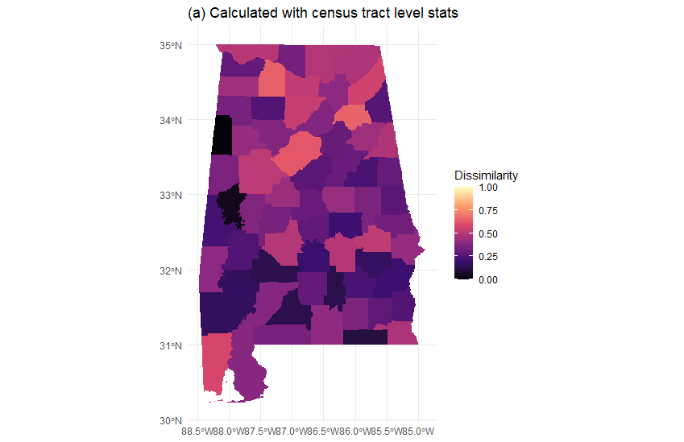
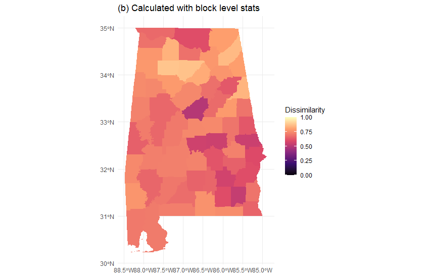

<!-- README.md is generated from README.Rmd. Please edit that file -->

# Calculating Residential Segregation Indices

The purpose of this repository is to provide a simple and reproducible
[R](https://www.r-project.org/) pipeline to investigate residential
segregation (RS) using US census data. The pipeline contains two
components:

1.  pulling decennial US census data of Year 2000, 2010, 2020 via R
    package [tidycensus](https://walker-data.com/tidycensus/index.html)
2.  calculating three residential segregation indices\*, including
    dissimilarity, isolation and interaction indices, at the preferred
    geographical level, e.g. county or census tract level

> \*: The implementation of the three scores in this pipeline is neither
> endorsement nor an emphasize. Researchers should study all residential
> segregation indices to choose the ones that match with their study
> objectives.

We hope this work would relieve social scientists from repetitive data
pulling, and inspire to adapt the reproducible pipeline.

> Note: If you don’t have the time to go through the whole
> documentation, please finish reading the [Remarks](#remarks) Section
> before modifying the code

## Get Started

1.  Download [R](https://www.r-project.org/) and [RStudio
    IDE](https://www.rstudio.com/products/rstudio/download/)
2.  Install the necessary workflow packages
    [`targets`](https://cran.r-project.org/web/packages/targets/index.html)
    and [`renv`](https://rstudio.github.io/renv/articles/renv.html) if
    you don’t already have
3.  Open the R project in RStudio and call `renv::restore()` to install
    the required R packages. Please give permission to install the
    necessary packages. This will mirror the version of packages used in
    the creation of the work exactly.
4.  Acquire your census api key string via
    <https://api.census.gov/data/key_signup.html>, and replace at the
    beginning of the `_targets.R` file
5.  Modify the code to reflect your research needs. We highlight the
    places that requires customization with the tag `TODO:`, which can
    be enlisted via a [global
    search](https://support.rstudio.com/hc/en-us/articles/200710523-Navigating-Code),
    i.e. `cmd/control + shift + f`.
    -   Change year, states, and geographic levels, where the upper
        level is your preferred level and the lower level is the level
        constituent the upper level. For example, in order to calculate
        county level indices (upper level), we need to have census tract
        level statistics (lower level).
    -   **Confirm if the variable codes in census databases match with
        your preferred variables.** The variable code is year-specific,
        i.e. could be different depending on the year you use. For
        example, the same variable code `P003003` means
        `Total!!Population of one race!!White alone` in [2000
        data](https://api.census.gov/data/2000/dec/sf1/variables.html),
        and means `Total!!Black or African American alone` [2010
        data](https://api.census.gov/data/2010/dec/sf1/variables.html)
6.  call `targets::tar_make()` in the console to run the pipeline.

## Examples

In this section, we provide two examples for calculating RS indices of
*one state* (stored in [`master`
branch](https://github.com/boyiguo1/Tutorial-Residential_Segregation_Score/tree/master))
or *multiple states* (stored in [`meds_desert`
branch](https://github.com/boyiguo1/Tutorial-Residential_Segregation_Score/tree/meds_desert))
respectively.

### One State Example: *2010 Alabama Dissimilarity Index at County Level*

In this example, we provide the pipeline to calculate the indices for a
single state. As an bonus, a section of code that plots a index to the
map are supplied, as shown in *Figure 1*\*. *Figure 1* includes two maps
of the 2010 Alabama County Level dissimilarity index, White (majority)
with respect to Black (minority), calculated using different definitions
of lower level geographic unit, i.e. census tract level and block level.

> \*: The example pipelie only produces one of the plots, where caption
> had been manually modified.

|  |  |
|--------------------------------------------------|--------------------------------------------------|

**Figure 1**: 2010 Alabama Dissimilarity Index at county level
calculated with census tract level statistics *(a)* and block level
statistics *(b)*

> Note: For those who are interested in 2020 AL Indices, please refer to
> [test
> case](https://github.com/boyiguo1/Tutorial-Residential_Segregation_Score/issues/7#issuecomment-1005776330)
> in [Issue
> 7](https://github.com/boyiguo1/Tutorial-Residential_Segregation_Score/issues/7)
> as an example of configuration

### Multiple States Example: *2010 RS Indices of Medication Desert at Census Tract Level*

The example demonstrate how to calculate residential segregation for
multiple states collectively, either via an intput file or via an inline
code. Please find the pipeline via
[`meds_desert`](https://github.com/boyiguo1/Tutorial-Residential_Segregation_Score/tree/meds_desert)
branch.

## Remarks

In this section, we discuss our observations when creating the indices,
which includes thoughts on numeric calculation with census data,
interpretation, and practice of data sharing.

### Numeric Calculation

1.  During the calculation, we observe that depending on how the areal
    units are defined, it is possible to have areas with no majority or
    minority population at all, i.e. *n*majority = 0 or
    *n*minority = 0. This complicates the calculation of the
    scores, for example, introducing infinite or `NaN` as a score.
    Without finding any remedies in the literature yet, we defined these
    indices as missing values collectively.

2.  It is very important to **confirm if your variable codes match with
    your anticipated variable with the census data base**. Even though
    we build error prevention mechanism in the code to numerically
    verifies, we are not certain it will catch the error 100%
    particularly with the flexibility that allow users’ customization.
    We provided how code changes in different years, see [Get
    started](#get-started).

3.  In the calculation, we do not assume that the minority numerically
    complements the majority, i.e the numbers of minority and majority
    sums to the total. These indices would be different from the indices
    calculated with the complementing assumption.

4.  The indices are claculated using their definition, which means they
    are possibly directionally different in their interpretation,
    e.g. interaction and isolation indices. The user will have to define
    their own reverse coding function to yield directionally consistent
    interpretation.

### Interpretation

The interpretation of residential segregation indices gets complicated
quickly depending on their areal definition. Hence, we don’t offer too
much suggestions. We highly recommended the user to carefully go through
Massey and Denton (1988) for more details when planning which indices
and which areal unit to use in calculation. For people who seeks
real-world example, we defer to Iceland and Weinberg (2002).

The followings are a few questions we had when calculating the
residential segregation across the US, instead of specific metropolitan
areas in previous studies.

1.  The residential segregation indices are caluclated by agregating
    statistics of smaller areal units, where the lower arear units can
    be defined differently. For example, when calculating the
    residentital segregation indices at the county level, it is possible
    to define the smaller areal unit be census tract or block. Different
    definitions can yield inconsistent scores, both the magnitude of
    scores and the ranking of the scores. How to interpret the
    inconsistency due to the different definitions of lower area units
    remains as a question to us.

2.  During calculating RS across multiple states, we observed there are
    few majority and minority with in an areal unit when we don’t assume
    majority and minority sum to total. For example, if we defined the
    White as majority and the Black as minority, there are few majority
    and minority in a areal unit that are in Indian reservation. Are the
    indices still well-defined in this case?

3.  With improved efforts to collect more diverse racial information, it
    is possible to have individuals who have more than one racial
    background. For example, in [2010 census
    data](https://api.census.gov/data/2010/dec/sf1/variables.html), we
    have a variable code `P003008` for `Total!!Two or More Races`. How
    to utilize this informaiton in calculating racial RS can lead to a
    fruitful discussion.

### Data Sharing Practice

1.  When sharing the indices with FIPS and GEOID as identifier, it is
    very important to treat FIPS and GEOID are characters/strings
    instead of numeric values because of the leading zeros. This
    practice will save more time and produce less error when sharing
    with others.

<!-- 2. For the ease of your collaborators, it is better to generate the GEOID when sending data pull request. Itspulling data, instead of giving individual FIPS for different levels. It is not a big  deal, but potentially create human error when concatenating the FIPS. for example leading zero problem -->

## Questions/Contribution

We prefer questions or bug reports via
[Issues](https://github.com/boyiguo1/Tutorial-Residential_Segregation_Score/issues/)
tab of the repository, such that the answer to your question can serve a
broader audience. We are also open to questions via Email if you don’t
feel comfortable with the aforementioned approach.

If you would like to contribute to this tutorial, we are welcome any
contribution via pull requests so that you get proper credit.

#### References

Iceland, John, and Daniel H Weinberg. 2002. *Racial and Ethnic
Residential Segregation in the United States 1980-2000*. Bureau of
Census.

Massey, Douglas S, and Nancy A Denton. 1988. “The Dimensions of
Residential Segregation.” *Social Forces* 67 (2): 281–315.

